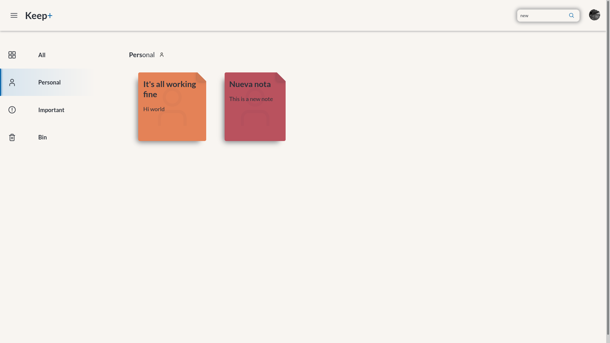

 <h1><strong>Keep Plus</strong></h1> 

<strong>&nbsp;P A G E &nbsp; L I N K &nbsp;🌎</strong>

 

[Keep Plus →](https://keep-plus-web.herokuapp.com/)

#

<strong>&nbsp;O V E R V I E W &nbsp;👁️‍🗨️</strong>

 

**Important note**: As there is no "Register" functionality implemented, it's recommended to use the "Log In with Google" button.
Much more secure as it's transparent to the developer, abstracting all the password-encryption mess.

Keep Plus is a web application that allows you to create and manage
simple notes with a **polished interface** and **integration with google auth**.

It uses:
* A [Mongo](https://github.com/mongodb/mongo) database to store scores and users
* A backend in Node using [Express.js](https://github.com/expressjs/express) and [Passport.js](https://github.com/jaredhanson/passport) to handle google OAuth
* A frontend in pure [React](https://github.com/facebook/react) in a single page

#

<strong>&nbsp;S C R E E N S H O T S &nbsp;📸</strong>

 

